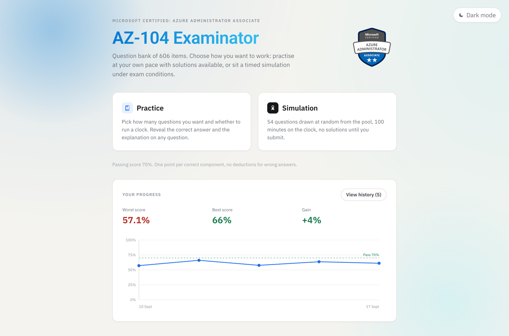
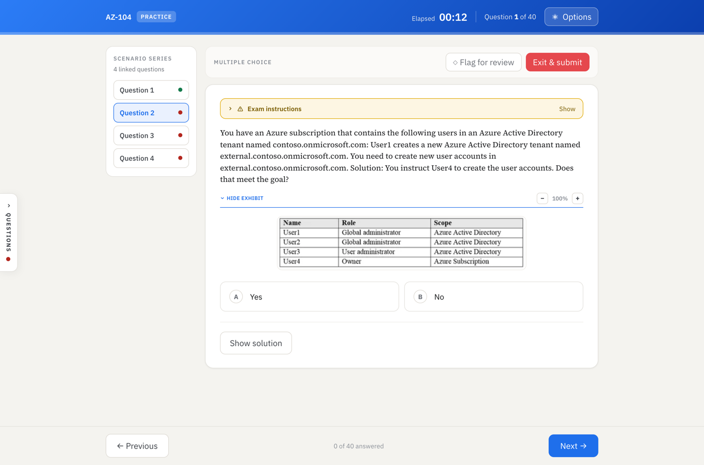
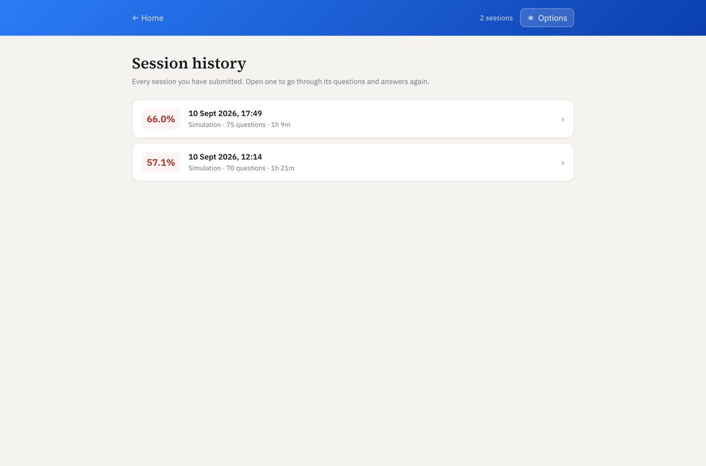

# AZ-104 Examinator

An exam simulator for the Microsoft AZ-104 (Azure Administrator Associate) certification, built around a question
bank of 606 items. 
.NET 10 Web API, PostgreSQL, React + TypeScript — the whole stack runs in Docker, so nothing
has to be installed locally except Docker itself.

## Screenshots

Home screen: pick a mode and see how your scores are trending across the sessions you have already sat.



A question during a practice session, with its attached screenshot (*exhibit*) open and the solution available on
demand.



History of submitted sessions: open any past attempt to go through its questions, your answers and the solutions.



## What it does

- **Two modes.** *Practice* lets you choose how many questions you want, whether to run a clock, and whether the
  solution should appear on its own as soon as you answer. *Simulation* is a fixed timed set under exam conditions.
- **Every question type is clickable and scored** — multiple choice, drag & drop sequences, hotspot rows and
  yes/no statements — rather than self-assessed.
- **Microsoft's own partial credit rule**: one point per correctly answered component, nothing deducted for wrong
  ones, so a single mistake never zeroes out a multi-part question.
- **Exhibits**: the screenshots that come with a question are shown inline and can be zoomed in and out, since many
  of them are small and dense.
- **History and progress**: every submitted session is kept with its questions and answers, and the home screen
  charts your scores over time.
- **Sessions survive an interruption.** The session in progress is saved as you go, so a reload, a closed tab or a
  laptop lid coming down doesn't cost you your answers — and the clock stops while the app is away.

## Project layout

```
AZ-104.Examinator.BE/          .NET backend (API + test project)
AZ-104.Examinator.FE/          React + TypeScript frontend
AZ-104.Examinator.Database/    SQL schema and question bank importer
AZ-104.QuestionsDataset/       Source data (JSON + a human-readable Markdown version)
docker-compose.yml
```

## Getting started

### First run

```bash
docker compose --profile setup run --rm importer
docker compose up -d
```

The first command creates everything it needs on its own — volume, database, schema — waits until it is ready and
imports the 606 questions: nothing else has to be started by hand beforehand. The second one brings up the API and
the frontend, which by then find a populated database.

The API is served at **http://localhost:5080**, with interactive documentation at **http://localhost:5080/swagger**.
The frontend is at **http://localhost:5173**.

### Subsequent runs

```bash
docker compose up -d
```

The database and the questions live in a Docker volume, so this command is all it takes — no need to run the
importer again. That is only necessary after a `docker compose down -v` (which wipes the volume), or when you want
to reload the question bank from an updated JSON file.

### Reloading the question bank

The importer replaces the contents of the question tables with what it reads from
`AZ-104.QuestionsDataset/az104_606_domande.json` — it is not incremental. Note that the JSON is **copied into
the importer image** at build time rather than mounted, so after editing the dataset rerun it with `--build`,
otherwise the stale copy gets imported again:

```bash
docker compose --profile setup run --rm --build importer
```

### Optional services

```bash
docker compose --profile dev up -d pgweb
```

A browser-based SQL client at http://localhost:8081, handy for inspecting the database without installing anything.

### Starting over (when something gets stuck)

When things jam — an image that won't update, a frontend still serving old code, a corrupted `node_modules` in the
volume — the quickest way out is to tear everything down and rebuild:

```bash
docker compose --profile dev --profile setup down -v --rmi local --remove-orphans
```

That removes containers, volumes (`pgdata` and `web_node_modules`) and locally built images (`api`, `web`,
`importer`) in one go. Both profiles have to be named, or `importer` and `pgweb` are left out of the cleanup.
Images pulled from external registries (`postgres`, `pgweb`, the .NET and Node base images) are left alone; to drop
those as well use `--rmi all`, at the cost of downloading them again on the next start.

If a `docker rmi` refuses with something like `image is being used by stopped container`, a stopped container is
still holding it — often one started by hand with `docker run`, and therefore invisible to `docker compose down`,
which only manages its own services:

```bash
docker ps -a                  # lists stopped containers too, with the image each one occupies
docker rm <container>         # remove the container holding it
docker rmi <image>            # now the image can go
```

Coming back from a cleanup takes both steps of the first run, not just `up`: the images have to be rebuilt and the
question bank re-imported, since `-v` wiped the database volume.

```bash
docker compose build --no-cache                    # optional: force a rebuild with no cache
docker compose --profile setup run --rm importer   # recreate the schema and reload the 606 questions
docker compose up -d
```

## Tests

```bash
cd AZ-104.Examinator.BE/AZ-104.Examinator.Api.Tests
dotnet test
```

No local Postgres is required: the repositories are substituted, never hit against a real database.

Without a local .NET SDK, the same suite runs in a container:

```bash
docker run --rm -v "$PWD/AZ-104.Examinator.BE:/src" -w /src/AZ-104.Examinator.Api.Tests \
  mcr.microsoft.com/dotnet/sdk:10.0 dotnet test
```

For the frontend, once `web` is up:

```bash
docker compose exec web npx tsc -b --noEmit   # type check only
docker compose exec web npm run lint
```

## Handy commands

```bash
docker compose --profile dev up -d    # start every service, pgweb included (without --profile it stays down)
docker compose down -v                # wipe everything, database volume included
docker compose stop pgweb             # stop a service behind a profile (it has to be named explicitly)
docker compose --profile dev down     # full cleanup, services behind profiles included
```
